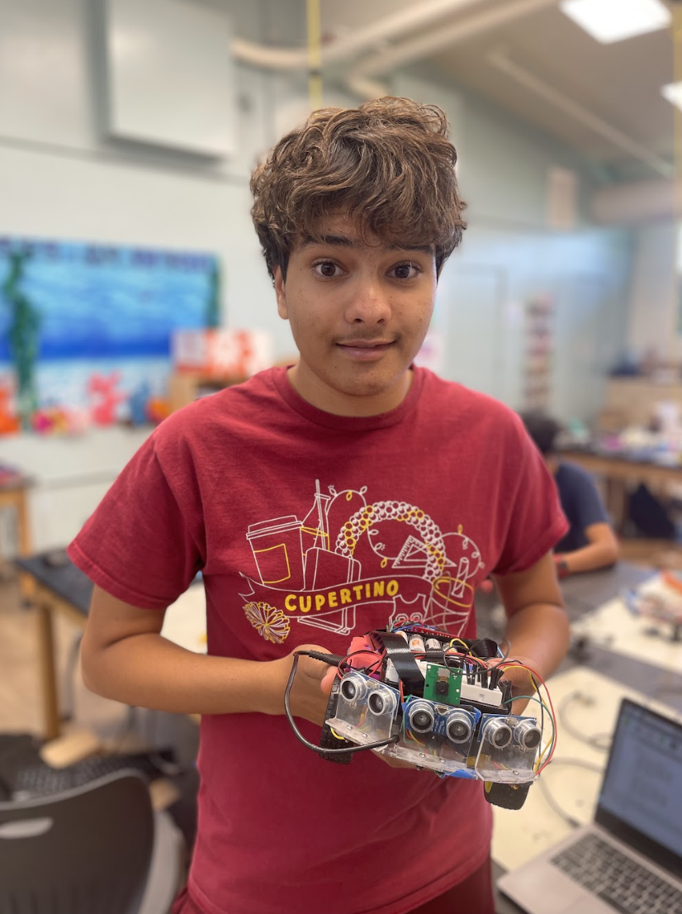
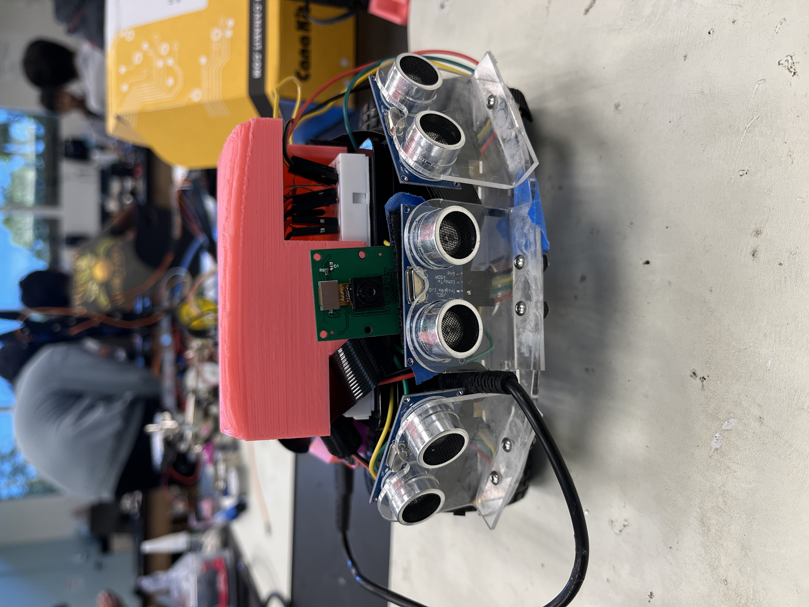
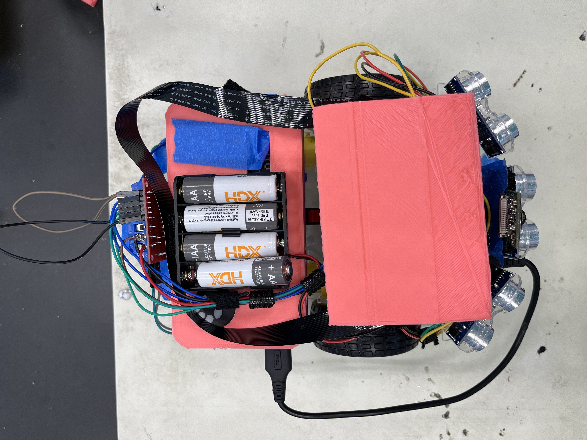
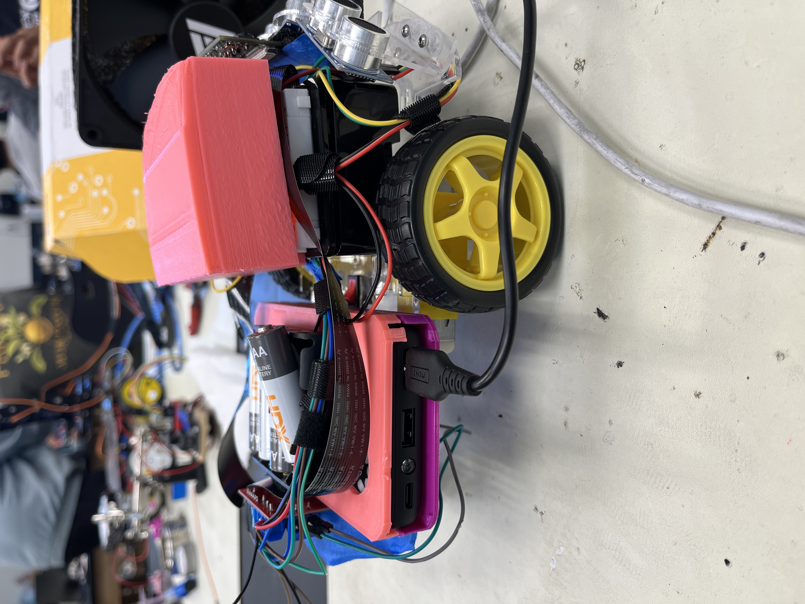

# Ball Tracking Robot with OpenCV: Computer Vision

This project is about making a ball-tracking robot using OpenCV, a Python library for computer vision. The robot has a Raspberry Pi computer, a PiCamera for detecting the ball, DC motors for moving the wheels, and ultrasonic sensors to avoid collisions. Each part works together to create a robot that can follow a ball.

|**Engineer** | **School** | **Area of Interest** | **Grade** |
|:--:|:--:|:--:|:--:|
| Dhruva J. | Cupertino HS | Computer Science | Incoming Junior |

<!---
**Replace the BlueStamp logo below with an image of yourself and your completed project. Follow the guide [here](https://tomcam.github.io/least-github-pages/adding-images-github-pages-site.html) if you need help.**


-->


<div style="display: flex; justify-content: space-between;">
  
  
  
</div>


# Final Milestone - Modification 


# Third Milestone
<iframe width="560" height="315" src="https://www.youtube.com/embed/7qswBFxCCM8?si=nluSNofW7a1fYUTV" title="YouTube video player" frameborder="0" allow="accelerometer; autoplay; clipboard-write; encrypted-media; gyroscope; picture-in-picture; web-share" referrerpolicy="strict-origin-when-cross-origin" allowfullscreen></iframe>

## Summary
My final milestone is to make the robot turn after detecting the red ball, then move to the red ball. This would be possible by sending the angle needed to turn the robot from the the Raspberry Pi to the motors. After that, the robot would move forward until the ball is directly in front of it. I coded for my robot's camera to sense on which side of the screen the ball was on. This was done by getting the center X-coordinates of the ball. If they were less than 200, then the ball was on the left side which would needd a left turn, if it was between 200 and 400 inclusive then the ball was in the middle and just needed to move forward, and if it was greater than 400, then the ball was on the right side and a right turn needed to be performed. I also coded that if the ball wasnt in the screen at all, then the robot would keep turning until the ball made it in the screen. After the robot moves towards the ball, I utilized the ultrasonic sensors to stop the robots wheels when it was less than or equal to 4 cm away from the ball. To make the robot move, the motors had to be used, the motor was connected to a small gear which was adjacent to another gear which would spin the wheels. To do this, we have to import the GPIO library by writing the code line of `import gpio as GPIO`. Then we can set our GPIO pins as variables which correspond to the raspberry pi pin numbers, after that, we have to setup our GPIO pins by writing `GPIO.setup(GPIO_PIN, GPIO.OUT)`. Finally we can make the motors move by writing `GPIO.output(GPIO_PIN, GPIO.HIGH)`, similarly we can make them stop by writing `GPIO.output(14, GPIO.LOW)`(Note: Each motor has 2 wire slots so to control a singular motor, you have to run these commands twice with different GPIO pin numbers).

## Challenges Faced
In this milestone I faced many challenges, My first challenge was with making the motors move, this problem was pretty quick to resolve as it turned out that I had my batteries plugged into the 5V slot in the H-bridge instead of the 12V slot, the batteries released 6V of electricity and the 5V slot wasnt enough. After I got my motors working, I wanted to download a software called RealVNC which would help me control my Raspberry Pi remotely without the use of an HDMI cable, I came across the problem where my host name and IP address were unidentified and nothing I did seemed to work, after close to four hours of troubleshooting, this problem was fixed by signing into a VNC account on both my computer and the raspberry pi, after that I could connect to the raspberry pi via a cloud connection. A cloud connection is especcially useful because both devices do not have to be on the same wifi network. The third challenge that I faced was that my camera abruptly stopped working. I was very confused because I didnt change any software or hardware. I used the `libcamera-hello` command in terminal to test my camera and I was getting a error. I decided to reboot my pi in hopes of it working, however that did not fix anything. Since I was using the 32-bit OS of Raspberry Pi, I decided to enable legacy camera(a old camera which is no longer supported) using the `sudo raspi-config` command in terminal. After turning this on and rebooting, the camera only worked in terminal. After running many commands and changing the config.txt file of the raspberry pi, I decided to change my OS to the 64-bit in hopes of it working as this problem happened to other students using the 32-bit OS. After flashing a new SD card into my pi, I finally got the camera to work again. My final challenge dealt with hardware, one of my motors started spinning way faster than the other motors which resulted in a angled turn instead of going fowards. To fix this, I re-sautered the motors to the jumper cables which seemed to fix the problem, however after a while, the motor sped up again so I decided to completely replace it, this worked and now both of my motors go at the same speed.

## Next Steps
Since I faced so many challenges with my third milestone, I spent around 4 days trying to complete them, this left me with not a lot of time left for my modification, however I wanted to do one, so I decided to do something that wouldnt take too long. I decided on 3d printing a top part for my breadboard because a lot of the wires were sticking out and I wanted to make my project look more asthetically pleasing instead of a huge electircal circuit. I will be using tinker CAD which is a online 3D designing software to design a case for my breadboard.

# Second Milestone
<iframe width="560" height="315" src="https://www.youtube.com/embed/f0EP63Y_y7k?si=bIUloyuRDF3nmtaL" title="YouTube video player" frameborder="0" allow="accelerometer; autoplay; clipboard-write; encrypted-media; gyroscope; picture-in-picture; web-share" referrerpolicy="strict-origin-when-cross-origin" allowfullscreen></iframe>

## Summary
My goal for this milestone was for the robot's camera to detect the red ball. This would be possible by taking a image from the robots camera and finding the largest area of red pixels. This was done by using OpenCV which is a python library. My code would see if there was a area of red pixels which was greater than 400. If so, then that would be the ball. If not, then that would not be the ball. The robot cannot be able to detect the ball if it was too far away since the area of red pixels would be less than 400. Since the ball could be a different shade of red in various lighting, I used HSV values to have a min and max value for my color. As long as the pixels were in between the range of the red values, then it would count it as a ball. I also had to make a limit on the size of the ball making sure that the radius was at least 15 pixels. To make the ball detection visible to the user, I added a green circle that accuratly matches the circumfrance of the ball.  

## Challenges Faced
I faced many challenges during this milestone. My first challenge was with Raspberry Pi identifying my camera. My camera was not starting and when using the `libcamera-hello` command in the terminal. It turned out that my camera was not completely secured since I forced in the ribbon instead of installing it the standered way by lifting the tabs and sliding it in. When I looked at my camera port, it turned out that some of the side broke off, however this was not a showstopper as I just followed normal procedure and the camera was working again. Another big challenge was figuring out the HSV values of the ball. To resolve this, I tried taking a picture of the ball and using the mac app called digital color meter to obtain the RGB color values and then translate them into HSV values. To do this, I got the brightest part and darkest part of the ball in order to set my range. However, this did not work and the program was not tracking the ball. I took some time to experiment with the values, while a lot of the values did track the ball correctly, they were also tracking other things such as the floor, skin, and things in the backround. Python or OpenCV also uses BGR(Blue, Green, Red) values instead of RGB(Red, Green, Blue) values which caused a lot of confusion as I thought that it was in RGB. 

## Next Steps
My first step is to test that all my sensors work. This is crucial because if anything doesnt work then I have to diagnose the problem as fast as possible. After that step, I want to fully complete the project by utilizing the motorsand ultrasonic sensors to create a fully moving robot! I have to download a software called RealVNC which acts like a remote PC so I will not have to connect my Pi via HDMI. This is useful mainly for moving robots because it is hard to move a robot which has a cable connected to the computer. RealVNC is also useful because you dont have to use a external mouse and keyboard to control the Pi. This is very helpful because now my PC can be portable so I can easily test the robot on the ground wirelessly.  

# First Milestone

<iframe width="560" height="315" src="https://www.youtube.com/embed/ORvmlinQZ_o?si=ZjFHiJ87LhuByG9k" title="YouTube video player" frameborder="0" allow="accelerometer; autoplay; clipboard-write; encrypted-media; gyroscope; picture-in-picture; web-share" referrerpolicy="strict-origin-when-cross-origin" allowfullscreen></iframe>

## Summary
My first milestone is to construct the overall build for the robot. I constructed the chassy and attached the battery pack, Raspberry pi, camera, breadboard, and infared sensors to it. I had to wire electrical components together for example, wiring the breadboard to the raspberry pi and connecting the h-bridge to the motors. I also had to solder some wires together because the slot would only allow one wire and I had to connect two wires. The raspberry pi's GPIO pins were connected to the H-bridge's in slots and where connected to the motors via the H-bridge's out slots. I also had to add three ultrasonic sensors to the front of my robot, this was for sensing when the ball came close. Each of the ultrasonic sensors had 4 pins to them: power, ground, trig, and echo. Power provides power to the sensor while the ground pin completes the circuit by preventing a short circut and completing the circle. Echo and Trig pins are unique to the ultrasonic sensor, the trig pin is used the trigger the ultrasonic sound pulses while the echo pin is used to produce a pulse when the signal is recieved. All 4 of these are necissary for the sensor to work. I finally utilized zipties to group all my wires togeather, this was benficial for both orginization and the overall asthetic look.

## Challenges Faced
One of the main challenges that I faced when building the overall build was managing my wires. Since I was using so many wires, there would be a lot of unorganized messy wires everywhere. I decided to use zipties to group wires that led to the same place. I also realised that the Raspberry Pi's case had a little gap at the top, this was helpful because I could fit wires through there, making it easier to organize my wires. Another challenge that I faced was assembling the chassy. This was because the screws were very hard to install because there was not enough space which required me to take apart everything and re install them. I also had some challenges with installing the PiCamera because I forced it into the slot on the Pi's motherboard instead of lifiting the tabs and carefully placing them in resulting in the holder for the camera chipping away and causing a loose connection. I fixed this by placing the camera in correctly by lifiting the tabs, and it worked when I tested it again. 

## Next Steps 
My next steps will be to configure my Raspberry Pi camera by installing the necissary libraries and to test it in the terminal using the `libcamera-hello` command. After that I will make sure that it works and can turn on via python code. Then I will apply a range of HSV values so that the camera detects the ball by seeing whichever pixels are within that range. I will also make this easier for a human to comprehend by adding a circle around the ball and using masks to highlight the outline of the ball in white on a black backround. 

# Schematics 


# Code

## Milestone 2
```python
 import time
import cv2
import numpy as np
from picamera2 import Picamera2

# Initialize Picamera2
picamera = Picamera2()
picamera.configure(picamera.create_preview_configuration(main={"size": (640, 480)}))
picamera.start()

# Color and font settings for drawing
colour = (0, 255, 0)  # Green color for the square
font = cv2.FONT_HERSHEY_SIMPLEX
origin = (50, 50)
scale = 1
thickness = 2

def apply_timestamp(frame):
    timestamp = time.strftime("%Y-%m-%d %X")
    cv2.putText(frame, timestamp, origin, font, scale, colour, thickness)

def detect_red_ball(frame):
    # Convert frame to HSV color space
    hsv = cv2.cvtColor(frame, cv2.COLOR_BGR2HSV)

    # Define lower and upper bounds for red color detection in HSV
    lower_red = np.array([0, 120, 120])
    upper_red = np.array([10, 255, 255])

    # Threshold the HSV image to get only red colors
    mask1 = cv2.inRange(hsv, lower_red, upper_red)
   
    lower_red = np.array([170, 120, 120])
    upper_red = np.array([180, 255, 255])
    mask2 = cv2.inRange(hsv, lower_red, upper_red)

    mask = mask1 + mask2

    # Apply a series of erosions and dilations to reduce noise
    mask = cv2.erode(mask, None, iterations=2)
    mask = cv2.dilate(mask, None, iterations=2)

    # Find contours in the mask
    contours, _ = cv2.findContours(mask.copy(), cv2.RETR_EXTERNAL, cv2.CHAIN_APPROX_SIMPLE)

    # Initialize center of the ball as None
    center = None

    # Proceed if at least one contour was found
    if len(contours) > 0:
        # Find the largest contour (assuming it's the ball)
        c = max(contours, key=cv2.contourArea)

        # Compute the minimum enclosing circle and centroid
        ((x, y), radius) = cv2.minEnclosingCircle(c)
        M = cv2.moments(c)
        center = (int(M["m10"] / M["m00"]), int(M["m01"] / M["m00"]))

        # Only proceed if the radius meets a minimum size
        if radius > 20:
            # Draw the circle and centroid on the frame
            cv2.circle(frame, (int(x), int(y)), int(radius), (255, 0, 0), 2)  # Red circle around the detected object
            cv2.putText(frame, "Red Ball", (int(x - radius), int(y - radius)), cv2.FONT_HERSHEY_SIMPLEX, 0.6, (255, 0, 0), 2)
    return frame

try:
    while True:
        # Capture frame-by-frame
        frame = picamera.capture_array()

        # Convert BGR to RGB
        frame = cv2.cvtColor(frame, cv2.COLOR_BGR2RGB)

        # Apply timestamp
        apply_timestamp(frame)

        # Detect red ball and draw on frame
        frame_with_detection = detect_red_ball(frame)

        # Display the frame with detection
        cv2.imshow('Frame', frame_with_detection)

        # Exit if 'q' is pressed
        if cv2.waitKey(1) & 0xFF == ord('q'):
            break

finally:
    cv2.destroyAllWindows()
    picamera.stop()      
```

## Testing Camera 
```python
 import cv2
        
        vid = cv2.VideoCapture(0)
        
        while(True):
            ret, frame = vid.read()
            height = frame.shape[0]
            width = frame.shape[1]
            
            if ret:
                
                # frame_r: resized tensor H/4,W/4, 3
                frame_r = cv2.resize(frame, (width//4,height//4))
                
                #swap channels (BGR)
                cv2.imshow('frame', frame_r[:,:,[2,1,0]])
                #cv2.imshow('frame', frame_r)
        
            if (cv2.waitKey(1) & 0xFF == ord('q')):
                break
                
        vid.release()
        cv2.destroyAllWindows()
```

## Testing Motors
```python
import RPi.GPIO as GPIO
        import cv2
        import numpy as np
        
        GPIO.setmode(GPIO.BCM)
        
        MOTOR1B=6 # LEFT motor
        MOTOR1E=5
        
        MOTOR2B=22 # RIGHT motor
        MOTOR2E=23 
        
        GPIO.setup(MOTOR1B, GPIO.OUT)
        GPIO.setup(MOTOR1E, GPIO.OUT)
        
        GPIO.setup(MOTOR2B, GPIO.OUT)
        GPIO.setup(MOTOR2E, GPIO.OUT)
        
        while(True):
            userInput = input()
            
            if(userInput == 'w'):
                GPIO.output(MOTOR1B,GPIO.HIGH)
                GPIO.output(MOTOR1E,GPIO.LOW)
                GPIO.output(MOTOR2B,GPIO.HIGH)
                GPIO.output(MOTOR2E,GPIO.LOW)
            
            if(userInput == 'a'):
                GPIO.output(MOTOR1B,GPIO.LOW)
                GPIO.output(MOTOR1E,GPIO.LOW)
                GPIO.output(MOTOR2B,GPIO.HIGH)
                GPIO.output(MOTOR2E,GPIO.LOW)
                
            if(userInput == 's'):
                GPIO.output(MOTOR1B,GPIO.LOW)
                GPIO.output(MOTOR1E,GPIO.HIGH)
                GPIO.output(MOTOR2B,GPIO.LOW)
                GPIO.output(MOTOR2E,GPIO.HIGH)
            
            if(userInput == 'd'):
                GPIO.output(MOTOR1B,GPIO.HIGH)
                GPIO.output(MOTOR1E,GPIO.LOW)
                GPIO.output(MOTOR2B,GPIO.LOW)
                GPIO.output(MOTOR2E,GPIO.LOW)
        
            if(userInput == 'x'):
                 GPIO.output(MOTOR1B,GPIO.LOW)
                 GPIO.output(MOTOR1E,GPIO.LOW)
                 GPIO.output(MOTOR2B,GPIO.LOW)
                 GPIO.output(MOTOR2E,GPIO.LOW)
```

## Testing Ultrasonic Sensors
```python
 import RPi.GPIO as GPIO
        import time
        GPIO.setmode(GPIO.BCM)
        
        TRIG_PIN = 11
        ECHO_PIN = 12
        
        GPIO.setup(TRIG_PIN, GPIO.OUT)
        GPIO.setup(ECHO_PIN, GPIO.IN)
        GPIO.output(TRIG_PIN, GPIO.LOW)
        
        time.sleep(2)
        
        GPIO.output(TRIG_PIN, GPIO.HIGH)
        
        time.sleep(0.00001)
        
        GPIO.output(TRIG_PIN, GPIO.LOW)
        
        while GPIO.input(ECHO_PIN) ==0:
            pulse_send=time.time()
        while GPIO.input(ECHO_PIN) ==1:
            pulse_received=time.time()
            
        pulse_duration=pulse_received - pulse_send
        pulse_duration=pulse_duration/2
        
        distance = 34300 * pulse_duration #speed of sound (cm/s) = 34300
        distance = round(distance,2)
        
        print ("object is at", distance, "cm from the ultrasonic sensor")
        
        GPIO.cleanup()
```

## Milestone 3 - Full Code
```python
import time
import cv2
import numpy as np
from picamera2 import Picamera2
import RPi.GPIO as GPIO

sensor_proximity = 10  # Middle sensor
rerouting_proximity = 17.5  # Side sensors only

lower_range = 30
upper_range = 290

GPIO.setmode(GPIO.BCM)

GPIO_TRIGGER1 = 11   # LEFT ultrasonic sensor
GPIO_ECHO1 = 9

GPIO_TRIGGER2 = 19   # FRONT ultrasonic sensor
GPIO_ECHO2 = 26

GPIO_TRIGGER3 = 16   # RIGHT ultrasonic sensor
GPIO_ECHO3 = 20

motor1B = 6  # LEFT motor
motor1E = 5

motor2B = 22  # RIGHT motor
motor2E = 23

en_a = 25  # Analog pins to control speed
en_b = 24

# Setup Ultrasonic sensors
GPIO.setup(GPIO_TRIGGER1, GPIO.OUT)  # Trigger 1
GPIO.setup(GPIO_ECHO1, GPIO.IN)  # Echo 1
GPIO.setup(GPIO_TRIGGER2, GPIO.OUT)  # Trigger 2
GPIO.setup(GPIO_ECHO2, GPIO.IN)  # Echo 2
GPIO.setup(GPIO_TRIGGER3, GPIO.OUT)  # Trigger 3
GPIO.setup(GPIO_ECHO3, GPIO.IN)  # Echo 3

# Set Ultrasonic triggers (TRIG) to false (low):
GPIO.output(GPIO_TRIGGER1, False)
GPIO.output(GPIO_TRIGGER2, False)
GPIO.output(GPIO_TRIGGER3, False)

def sonar(GPIO_TRIGGER, GPIO_ECHO):
    start = 0
    stop = 0
    GPIO.setup(GPIO_TRIGGER, GPIO.OUT)  # Trigger
    GPIO.setup(GPIO_ECHO, GPIO.IN)      # Echo

    GPIO.output(GPIO_TRIGGER, False)  # Set trigger to False (Low)
    time.sleep(0.01)  # Allow module to settle

    # Send 10us pulse to trigger
    GPIO.output(GPIO_TRIGGER, True)
    time.sleep(0.00001)
    GPIO.output(GPIO_TRIGGER, False)

    begin = time.time()
    while GPIO.input(GPIO_ECHO) == 0 and time.time() < begin + 0.05:
        start = time.time()

    while GPIO.input(GPIO_ECHO) == 1 and time.time() < begin + 0.1:
        stop = time.time()

    elapsed = stop - start  # Calculate pulse length
    distance = elapsed * 34300  # Distance pulse traveled in that time is time multiplied by the speed of sound (cm/s)
    distance = distance / 2  # That was the distance there and back, so take half of the value

    return distance  # Reset GPIO settings, return distance (in cm) appropriate to be used for robot movement

# Set all motors to outputs
GPIO.setup(motor1B, GPIO.OUT)
GPIO.setup(motor1E, GPIO.OUT)
GPIO.setup(motor2B, GPIO.OUT)
GPIO.setup(motor2E, GPIO.OUT)

GPIO.setup(en_a, GPIO.OUT)
GPIO.setup(en_b, GPIO.OUT)

power_a = GPIO.PWM(en_a, 100)
power_a.start(70)

power_b = GPIO.PWM(en_b, 100)
power_b.start(70)

def forward():
    print("moving f")
    GPIO.output(motor1B, GPIO.HIGH)
    GPIO.output(motor1E, GPIO.LOW)
    GPIO.output(motor2B, GPIO.HIGH)
    GPIO.output(motor2E, GPIO.LOW)

def reverse():
    GPIO.output(motor1B, GPIO.HIGH)
    GPIO.output(motor1E, GPIO.LOW)
    GPIO.output(motor2B, GPIO.HIGH)
    GPIO.output(motor2E, GPIO.LOW)

def leftturn():
    GPIO.output(motor1B, GPIO.LOW)
    GPIO.output(motor1E, GPIO.LOW)
    GPIO.output(motor2B, GPIO.HIGH)
    GPIO.output(motor2E, GPIO.LOW)
    time.sleep(0.15)

def rightturn():
    GPIO.output(motor1B, GPIO.HIGH)
    GPIO.output(motor2B, GPIO.LOW)
    GPIO.output(motor2E, GPIO.LOW)
    GPIO.output(motor1E, GPIO.LOW)
    time.sleep(0.15)


def stop():
    GPIO.output(motor1B, GPIO.LOW)
    GPIO.output(motor1E, GPIO.LOW)
    GPIO.output(motor2B, GPIO.LOW)
    GPIO.output(motor2E, GPIO.LOW)

def sharp_left():
    GPIO.output(motor1B, GPIO.HIGH)
    GPIO.output(motor1E, GPIO.LOW)
    GPIO.output(motor2B, GPIO.LOW)
    GPIO.output(motor2E, GPIO.HIGH)

def sharp_right():
    GPIO.output(motor1B, GPIO.LOW)
    GPIO.output(motor1E, GPIO.HIGH)
    GPIO.output(motor2B, GPIO.HIGH)
    GPIO.output(motor2E, GPIO.LOW)

def back_left():
    GPIO.output(motor1B, GPIO.HIGH)
    GPIO.output(motor1E, GPIO.HIGH)
    GPIO.output(motor2B, GPIO.HIGH)
    GPIO.output(motor2E, GPIO.LOW)

def back_right():
    GPIO.output(motor1B, GPIO.HIGH)
    GPIO.output(motor1E, GPIO.LOW)
    GPIO.output(motor2B, GPIO.HIGH)
    GPIO.output(motor2E, GPIO.HIGH)

# Initialize Picamera2
picamera = Picamera2()
picamera.configure(picamera.create_preview_configuration(main={"size": (320, 240)}))
picamera.start()

# Color and font settings for drawing
colour = (0, 255, 0)  # Green color for the square
font = cv2.FONT_HERSHEY_SIMPLEX
origin = (50, 50)
scale = 1
thickness = 2

def apply_timestamp(frame):
    timestamp = time.strftime("%Y-%m-%d %X")
    cv2.putText(frame, timestamp, origin, font, scale, colour, thickness)

def detect_red_ball(frame):
    # Convert frame to HSV color space
    hsv = cv2.cvtColor(frame, cv2.COLOR_BGR2HSV)

    # Define lower and upper bounds for red color detection in HSV
    lower_red = np.array([150, 140, 1])
    upper_red = np.array([190, 255, 255])

    # Threshold the HSV image to get only red colors
    mask1 = cv2.inRange(hsv, lower_red, upper_red)
   
    mask = mask1

    # Apply a series of erosions and dilations to reduce noise
    mask = cv2.erode(mask, None, iterations=2)
    mask = cv2.dilate(mask, None, iterations=2)

    # Find contours in the mask
    contours, _ = cv2.findContours(mask.copy(), cv2.RETR_EXTERNAL, cv2.CHAIN_APPROX_SIMPLE)

    # Initialize center of the ball as None
    center = None

    # Proceed if at least one contour was found
    if len(contours) > 0:
        # Find the largest contour (assuming it's the ball)
        c = max(contours, key=cv2.contourArea)

        # Compute the minimum enclosing circle and centroid
        ((x, y), radius) = cv2.minEnclosingCircle(c)
        M = cv2.moments(c)
        center = (int(M["m10"] / M["m00"]), int(M["m01"] / M["m00"]))

        # Only proceed if the radius meets a minimum size
        if radius > 10:
            # Draw the circle and centroid on the frame
            cv2.circle(frame, (int(x), int(y)), int(radius), (255, 0, 0), 2)  # Red circle around the detected object
            cv2.putText(frame, "Red Ball", (int(x - radius), int(y - radius)), cv2.FONT_HERSHEY_SIMPLEX, 0.6, (255, 0, 0), 2)
            return frame, center, radius
    return frame, None, 0

def segment_colour(frame):  # returns only the red colors in the frame
    hsv_roi = cv2.cvtColor(frame, cv2.COLOR_BGR2HSV)
   
    mask_1 = cv2.inRange(hsv_roi, np.array([150, 140, 1]), np.array([190, 255, 255]))  # Experimentally set BGR values appropriate for desired color

    mask = mask_1
    kern_dilate = np.ones((8, 8), np.uint8)
    kern_erode = np.ones((3, 3), np.uint8)
    mask = cv2.erode(mask, kern_erode)  # Eroding
    mask = cv2.dilate(mask, kern_dilate)  # Dilating
   
    (h, w) = mask.shape
   
    cv2.imshow('mask', mask)  # Shows mask (B&W screen with identified red pixels)
   
    return mask

def no_obstacle(distanceL, distanceC, distanceR):
    if distanceL > sensor_proximity and distanceC > sensor_proximity and distanceR > sensor_proximity:
        return True
    return False

def find_blob(blob):
    contours, _ = cv2.findContours(blob.copy(), cv2.RETR_EXTERNAL, cv2.CHAIN_APPROX_SIMPLE)
    largest_contour = 0
    cont_index = -1

    for idx, contour in enumerate(contours):
        area = cv2.contourArea(contour)
        if (area > largest_contour):
            largest_contour = area
            cont_index = idx

    r = (0, 0, 2, 2)
   
    if len(contours) > 0:
        r = cv2.boundingRect(contours[cont_index])  # Fitting rectangle to cover identified object
   
    return r, largest_contour

def reroute(frame, mask):  # Avoids obstacles by changing direction (left / right)
    (cy, cx) = mask.shape
    r, area = find_blob(mask)
    distL = sonar(GPIO_TRIGGER1, GPIO_ECHO1)
    distC = sonar(GPIO_TRIGGER2, GPIO_ECHO2)
    distR = sonar(GPIO_TRIGGER3, GPIO_ECHO3)
   
    if(area > 50):  # If a red object exists
        if(r[0] > upper_range):  # Turn right if red object is closer to the right
            print('RIGHT')
            rightturn()
            time.sleep(0.3)
            stop()
        elif(r[0] < lower_range):  # Turn left if red object is closer to the left
            print('LEFT')
            leftturn()
            time.sleep(0.3)
            stop()
        else:  # If the red object is in the center
            if distC > sensor_proximity:
                print('FORWARD')
                forward()
                #time.sleep(0.15)
                #stop()
            else:  # If there is an obstacle in the center
                if distL < rerouting_proximity and distR > rerouting_proximity:
                    print('Obstacle detected! Rerouting... SHARP RIGHT')
                    sharp_right()
                    time.sleep(0.3)
                    stop()
                elif distR < rerouting_proximity and distL > rerouting_proximity:
                    print('Obstacle detected! Rerouting... SHARP LEFT')
                    sharp_left()
                    time.sleep(0.3)
                    stop()
                else:
                    print('Obstacle detected! Rerouting... REVERSE')
                    reverse()
                    time.sleep(0.3)
                    stop()
    else:
        stop()
        time.sleep(0.1)

try:
    while True:
        frame = picamera.capture_array()
                # Convert BGR to RGB
        frame = cv2.cvtColor(frame, cv2.COLOR_BGR2RGB)
        apply_timestamp(frame)
        frame, center, radius = detect_red_ball(frame)
        mask = segment_colour(frame)

        # Display intermediate results for debugging
        cv2.imshow("Frame", frame)
        cv2.imshow("Mask", mask)

        if center is not None:
            print(f"Ball position: {center}, Radius: {radius}")
            reroute(frame, mask)
        else:
            print("No ball detected")
            sharp_left()
            time.sleep(0.3)
            stop()
           

        # Breaking out of the loop
        if cv2.waitKey(1) & 0xFF == ord("q"):
            break

finally:
    stop()
    GPIO.cleanup()
    cv2.destroyAllWindows()
    picamera.stop()


```


# Bill of Materials

| **Part**            | **Use**                   | **Price** | **Link**                                                                                                                                    |
|:-------------------:|:--------------------------:|:---------:|:------------------------------------------------------------------------------------------------------------------------------------------:|
| Raspberry Pi        | Building the Raspberry Pi  | $99.95    | [Link](https://www.canakit.com/raspberry-pi-4-starter-kit.html)                                                                            |
| Emonzy Chassis      | The base for the vehicle   | $12.99    | [Link](https://www.amazon.com/Smart-Chassis-Motors-Encoder-Battery/dp/B01LXY7CM3/ref=asc_df_B01LXY7CM3/?tag=hyprod-20&linkCode=df0&hvadid=693448563566&hvpos=&hvnetw=g&hvrand=13188769298549160467&hvpone=&hvptwo=&hvqmt=&hvdev=c&hvdvcmdl=&hvlocint=&hvlocphy=9032183&hvtargid=pla-584495246069&psc=1&mcid=3f54405bf4d93ae384d78ef10f75b962&gad_source=1) |
| Power Bank BI-B41   | Powering the Raspberry Pi  | $19.99    | [Link](https://iniushop.com/products/iniu-b41-portable-charger-15w-fast-charging-slimmest-10000mah?variant=43637931147442&currency=USD&utm_medium=product_sync&utm_source=google&utm_content=sag_organic&utm_campaign=sag_organic&gad_source=1&gclid=CjwKCAjwjqWzBhAqEiwAQmtgT1XwMCJbZkhMTRSuZs4hHaQyGw7Jys7nqwnwtI10GClJyrz8Do8syxoCC0AQAvD_BwE) |
| Breadboard | Connecting the electrical circuits | $2.33 | [Link](https://www.amazon.com/ELEGOO-tie-points-breadboard-Arduino-Jumper/dp/B01EV640I6/ref=sr_1_3?crid=1B2OOFCZPLH09&dib=eyJ2IjoiMSJ9.c3AY57g3DJYx1mV7GL3Z2BI7VibPC8inlAG7IgmFmBylQ1IYt_Q8-A2F8NYW2VoP8zxEXvFyPX4v8cE_nDBNctifJt4txhQ_3ee7GJ_JPAfhix9ISztD_Flaob8teY24RDocApew_6ggjXw-6TapCa6RKIFjgk2YDJCVZC_oqui-dnrQ7bmOb-QMemrgLq9K-NNIbeOwuG3U1KKIKwpq0_8Ng45zZBz_hMuiasUIUgI.diGqVHf1K4w9nydJ8Bc3Dfvz_GEmWAN_Yd6s-8IDG2o&dib_tag=se&keywords=half+breadboard&qid=1718304133&sprefix=half+breadboard%2Caps%2C126&sr=8-3) |
| Ultrasonic Sensor x3 | Measuring the distance to the ball | $4.50 | [Link](https://www.sparkfun.com/products/15569) |
| PiCamera | Identifying the ball | $17.98 | [Link](https://www.amazon.com/Raspberry-Pi-Camera-Module-Megapixel/dp/B01ER2SKFS) |
| H-Bridge | Sending commands to motors| $6.49 | [Link](https://www.amazon.com/Diymall-Module-Stepper-Modules-Arduino/dp/B00NJOTBOK/ref=asc_df_B00NJOTBOK/?tag=hyprod-20&linkCode=df0&hvadid=693611984328&hvpos=&hvnetw=g&hvrand=12308173357640503104&hvpone=&hvptwo=&hvqmt=&hvdev=c&hvdvcmdl=&hvlocint=&hvlocphy=9032183&hvtargid=pla-2062985254553&psc=1&mcid=170f1bbf2f773d04a1c0254ec6413a12&gad_source=1) |
|HDMI video card| Connecting the raspberry Pi to HDMI cable | $9.98 | [Link](https://www.amazon.com/Audio-Express-AXHDCAP-Broadcasting-Conference/dp/B0C2MDTY8P/ref=sr_1_3?crid=U4CUHUZBHSK1&dib=eyJ2IjoiMSJ9.m1E68xLLqhA5tsiHj04YRLTlrtsDFWVF1jBPX11qVF9HrCb6jkGcDu1PjvySsT0J8hXas4L_1z7cbIHWpGaAIQKpoAaxiLxh7ZuFmEsbQqxinsjPercbZCtU-SJadCXbLqv-FpU5kxqyDVo8kRtgCUwGv91nY-e5XtA4CaQFioqIT288oOxIh0itUh86MN7eOY6l7YeHUaXteaQT9ZDVEuWE8rXgtDVXob8ZikDf-H_VPEDdhj3j7JRp7VeJJRTQnDuO9IcugRszx6BHd3niMHcnhAJfOZbBEpQ0vNeBhDM.gGLVqhNz78KjP1oO9j9f2i-mKm2jLcKgS_nEk025k-U&dib_tag=se&keywords=hdmi+video+capture&qid=1719441994&s=electronics&sprefix=HDMI+video%2Celectronics%2C179&sr=1-3) |
|HDMI video cable type mini to type C | Connecting video card to computer | $7.82 | [Link](https://www.amazon.com/Amazon-Basics-Charging-Transfer-Gold-Plated/dp/B00NH11N5A/ref=asc_df_B00NH11N5A/?tag=hyprod-20&linkCode=df0&hvadid=693340910094&hvpos=&hvnetw=g&hvrand=583614035743564262&hvpone=&hvptwo=&hvqmt=&hvdev=c&hvdvcmdl=&hvlocint=&hvlocphy=9032183&hvtargid=pla-330035844136&mcid=d3790c59b9dd342995b6a48895a3976c&gad_source=1&th=1) |
|Assorted jumper wires | Connecting from H-bridge/Breakboard to GPIO pins | $6.49 | [Link](https://www.amazon.com/EDGELEC-Breadboard-1pin-1pin-Connector-Multicolored/dp/B07GD2BWPY/ref=sr_1_3?crid=3C4YB6HOGZ8ZQ&keywords=female%2Bto%2Bfemale%2Bjumper&qid=1689894791&s=electronics&sprefix=female%2Bto%2Bfemale%2Bjumper%2Celectronics%2C161&sr=1-3&th=1) |

Total Price: $188.52

<!---
# Other Resources/Examples
One of the best parts about Github is that you can view how other people set up their own work. Here are some past BSE portfolios that are awesome examples. You can view how they set up their portfolio, and you can view their index.md files to understand how they implemented different portfolio components.
- [Example 1](https://trashytuber.github.io/YimingJiaBlueStamp/)
- [Example 2](https://sviatil0.github.io/Sviatoslav_BSE/)
- [Example 3](https://arneshkumar.github.io/arneshbluestamp/)

To watch the BSE tutorial on how to create a portfolio, click here.
-->
# Tutorial

Hello Jack, it is 2 am and I am very tired, I will finish this tommorow Jun 28 2024

# Starter Project - Calculator 

<iframe width="560" height="315" src="https://www.youtube.com/embed/JeRtqHQ6S8k?si=xQgf9Ill7YbIALUa" title="YouTube video player" frameborder="0" allow="accelerometer; autoplay; clipboard-write; encrypted-media; gyroscope; picture-in-picture; web-share" referrerpolicy="strict-origin-when-cross-origin" allowfullscreen></iframe>

## Summary
For my starter project, I created a functional calculator. The calculator was able to perform simple action such as adding, subtracting, multiplying, and dividing two numbers. It could also deal with decimals and scientific notification if a number was too large or small to fit in its 6 digit screen. When you press the buttons on the calculator, it sends a packet to the main computer of the calculator which would perform the operation. Finally, the computer will print the final answer on its six digit screen.

## Components Used
- 1x Raspberry Pi minicomputer 
- 1x Usb Socket
- 1x Resistor
- 17x Push Down Buttons 
- 17x Button Caps

## Challenges Faced
Some challenges I faced, include adding the case to my calculator. The screws were pretty hard to tighten and my case was loose which forced me to restart making it. Another challenge I faced was that my resistor went too tall so I had to bend it in order to make it fit in the case. I also had some challenges with soldering because the pins were too close to eachother and one wrong move would make it not work.
